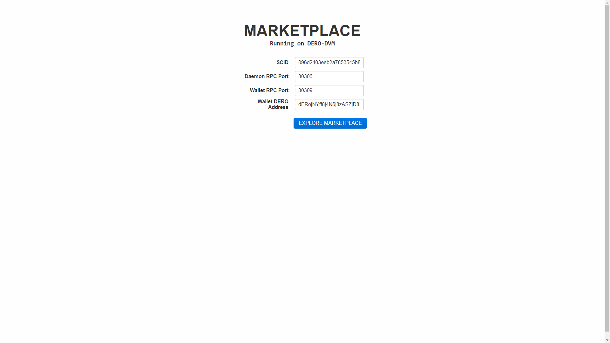
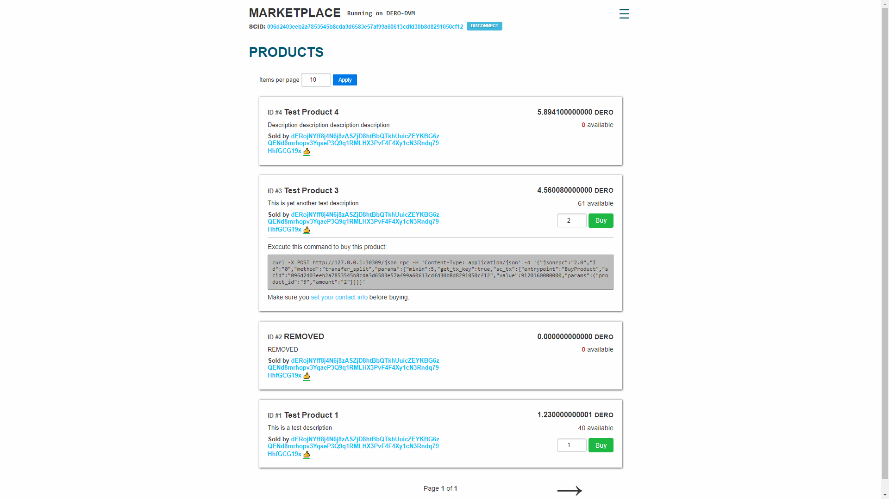
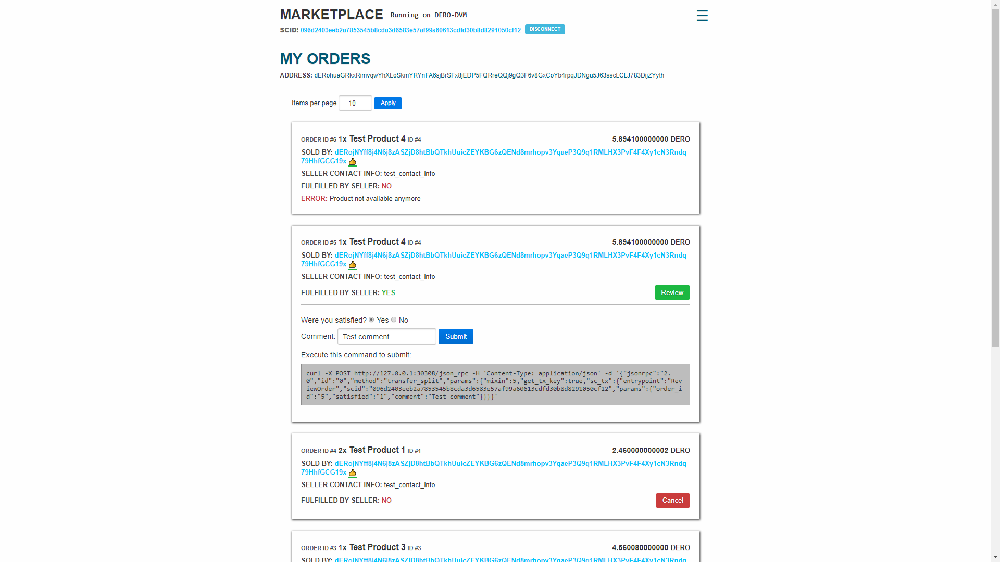
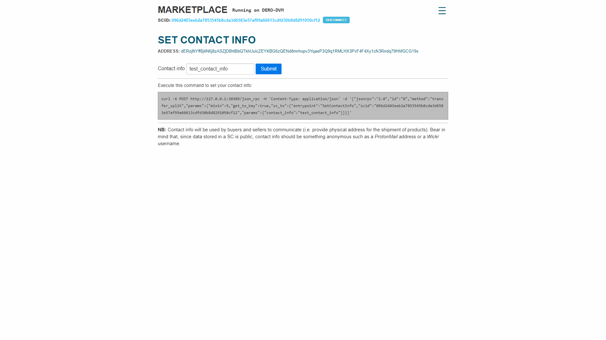
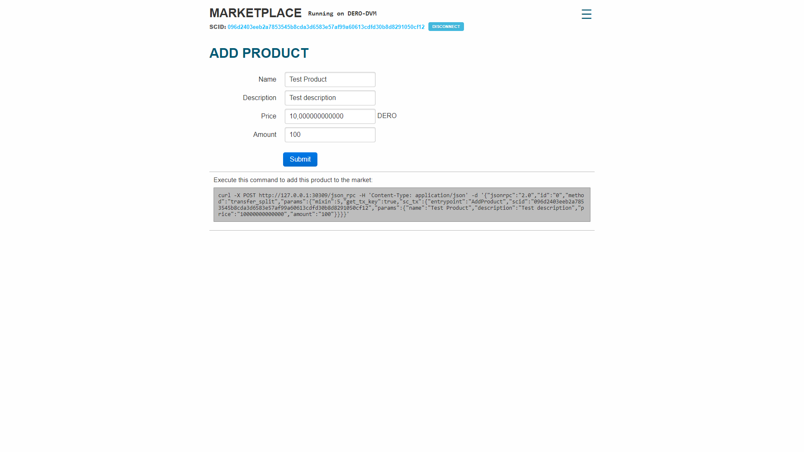
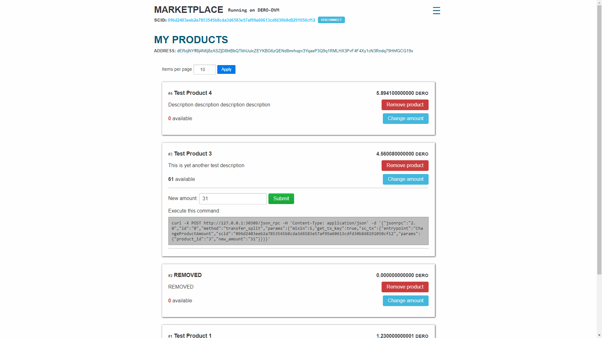
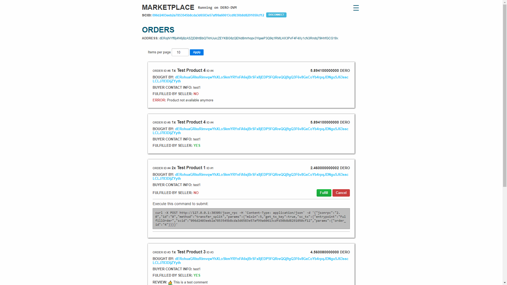

# DERO Marketplace Smart Contract

>Built for the [Dero Smart Contract build competition](https://forum.dero.io/t/dero-smart-contract-build-competition/891)  
**SCID**: 096d2403eeb2a7853545b8cda3d6583e57af99a60613cdfd30b8d8291050cf12

Fully functional yet simple marketplace where users can buy and sell goods without the need of a centralized e-commerce platform.

Made in DERO-BASIC, running on the **DERO-DVM**.

## Schema

Refer to [Schema.txt](./Schema.txt) to understand the structures the marketplace is made up on.

## Functions

### Seller functions

**AddProduct**(_name, description, price, amount_) - Adds a new product to the marketplace.

**RemoveProduct**(_product_id_) - Removes a product from the marketplace.

**ChangeProductAmount**(_product_id, new_amount_) - Changes the amount of a product for sale.

**FulfillOrder**(_order_id_) - Confirms a order went through thus sending the funds to the seller.

### Buyer functions

**BuyProduct**(_value, product_id, amount_) - Buys a product. **_value_** should be equal to the product price multiplied by the amount bought. If not, unused coins will be sent back to the buyer address.

**ReviewOrder**(_order_id, satisfied, comment_) - Reviews a order. The buyer can either give a **positive** (_satisfied_ = 1) or a **negative** (_satisfied_ = 0) opinion. _Comment_ is optional. By reviewing an order, its seller gets a feedback. Total feedback is equal to positive feedback minus negative feedback.

### Common functions

**CancelOrder**(_order_id, reason_) - Cancels a order. Can be used by either the buyer or the seller. Spent coins will be returned to the buyer. A order can not be canceled if it has already been fulfilled by the seller.

**SetContactInfo**(_contact_info_) - Sets the contact info of a user. Said contact info is needed in order for buyers and sellers to communicate shipping addresses/other info. Since data stored on the blockchain is currently public, _contact_info_ should be something anonymous such as a ProtonMail address or a Wickr username.

## Frontend

I felt a frontend for this SC was needed in order to display data (products, orders and reviews) in a readable and understandable way to the human eye and to make interactions (buy/sell/etc) easier.

It's not going to be neither the best looking frontend, nor the most well coded but, since the main focus of the competition was to build a functional smart contract anyway, I decided to sacrifice beauty and fancy frameworks for semplicity and lightweighness' sake. I like React/Vue like anyone else but I felt they would've been overkill, so I went along with good ol' plain JavaScript ES8.

### How to run

1. Download the _frontend_ folder from this repository
2. Make sure daemon and wallet are running and synced.
3. Open your web browser with web security disabled. This is needed in order to bypass a CORS issue with the daemon's JSON RPC server (thanks to [plspro](https://github.com/plrspro) for providing this quick fix). Example (Chrome on Ubuntu):
   
   ```$ google-chrome --disable-web-security --user-data-dir=/path/to/data/dir```   
4. Open index.html with your browser.

Tested on the latest version of Chrome and Firefox. If you're using a older browser and running into compatibility issues, you may need to pass the js file through [BabelJS](https://babeljs.io/repl) and the css file through a [prefixer](https://autoprefixer.github.io/).

### Screenshots

Connection


Market


Buyer Orders


Set Contact Info


Add Product


Seller Products


Seller Orders


# Thanks to

* [Captain](https://twitter.com/deroproject), [Dank](https://twitter.com/danktr0n) and the rest of the team and staff for building the [DERO](https://dero.io/) blockchain and making the competition possible.
* [Slixe](https://github.com/Slixe/), [Nelbert442](https://github.com/Nelbert442), [plspro](https://github.com/plrspro), [LifeTyper](https://github.com/lifetyper), hazet36, ZoZ, kryptoid, Joshy and every other member of the [DERO community](https://discord.gg/H95TJDp) for always being active and helpful.
